# Guild Manager

## System Architecture Diagrams

---

# 1. High Level Architecture

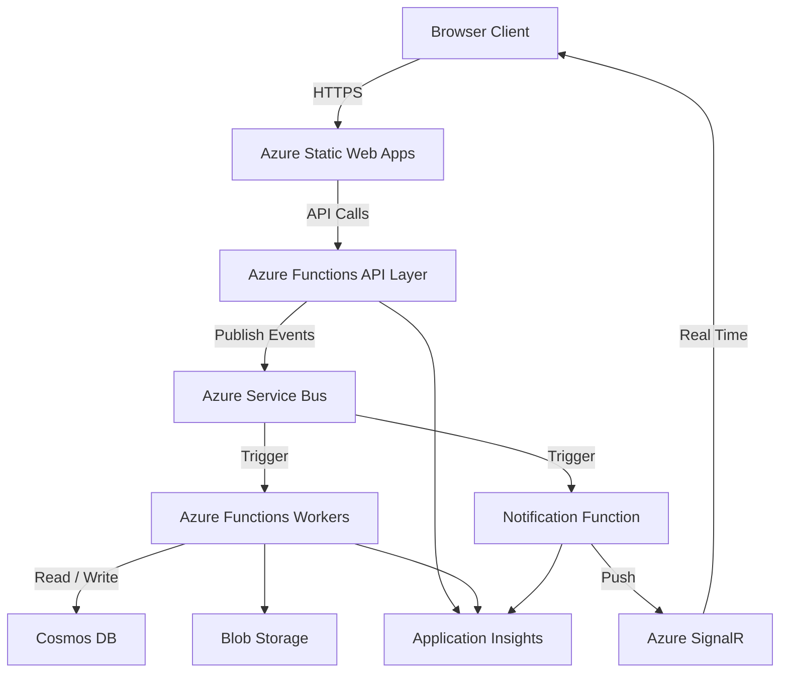

Explanation:

The frontend calls API endpoints hosted by Azure Functions.
Functions publish events to Service Bus.
Worker functions consume events and update system state in Cosmos DB.
The Notification Function consumes domain events and pushes real time messages to the client through Azure SignalR.

Application Insights collects telemetry across the system.

---

# 2. Core Azure Services

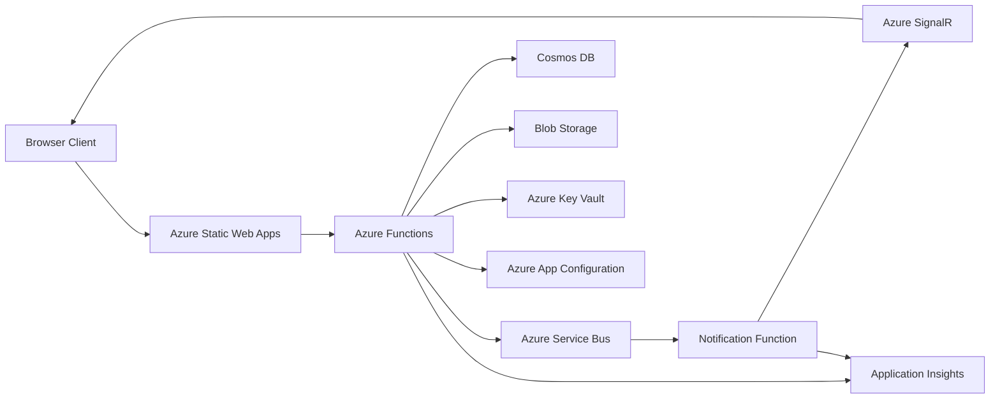

This diagram shows how operational services integrate with the runtime system.

---

# 3. Quest Workflow

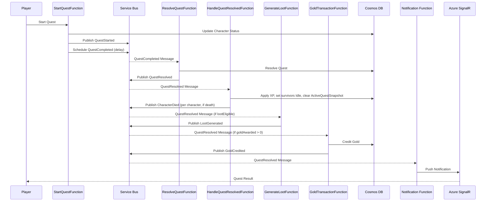

Key architectural concepts:

Service Bus **scheduled messages** replace background timers.

The **QuestResolved** event is the single resolution event. Downstream consumers (`HandleQuestResolvedFunction`, `GenerateLootFunction`, `GoldTransactionFunction`) each react to `QuestResolved` independently.

---

# 4. Player Onboarding Flow

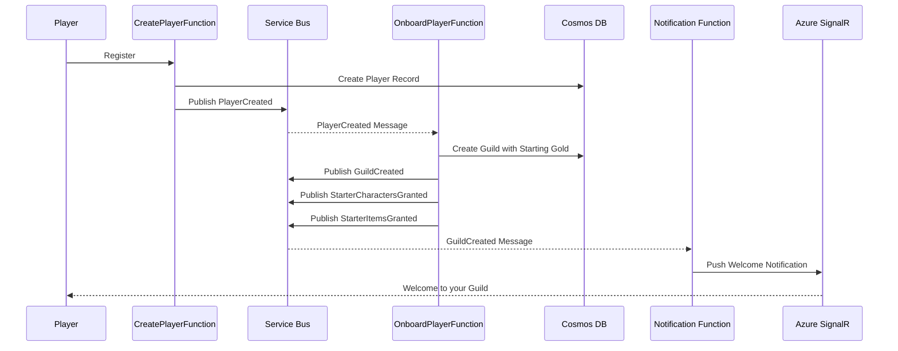

The onboarding flow provisions a new player's guild, starter characters, and starter items through a sequence of domain events.

---

# 5. Loot Generation Pipeline

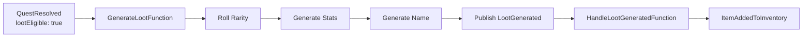

`GenerateLootFunction` consumes `QuestResolved` when `lootEligible` is true. It procedurally generates an item (rarity, stats, name) and publishes `LootGenerated`. The downstream `HandleLootGeneratedFunction` appends the item to `Player.stash` and publishes `ItemAddedToInventory`.

---

# 6. Market Workflow

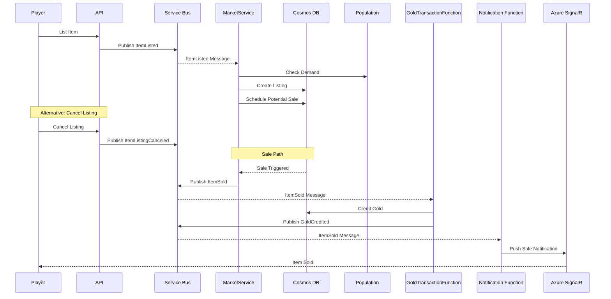

Market price is influenced by population demand.

The full lifecycle includes listing, optional cancellation, sale, and gold crediting.

---

# 7. Population Update Flow

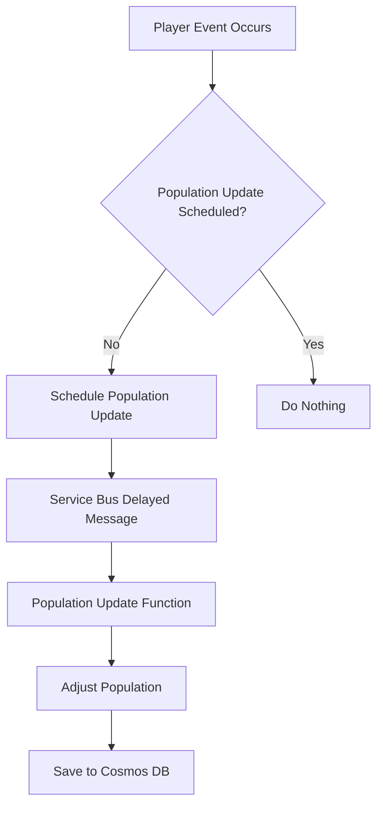

Population updates only occur when the system is active.

This prevents unnecessary compute usage.

---

# 8. Observability Architecture

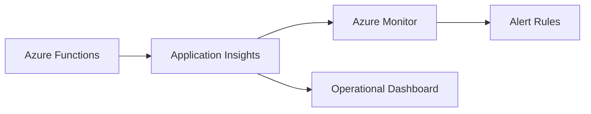

Observability pipeline:

Logs
Metrics
Distributed traces

All collected through Application Insights.

---

# 9. Event Driven System Overview

```mermaid
flowchart LR

PlayerCreated

GuildCreated

StartQuest[QuestStarted]

QuestCompleted

QuestResolved

LootGenerated

ItemEquipped

ItemListed

ItemSold

GoldCredited

AdventurerRecruited

PopulationUpdate[PopulationUpdated]

PlayerCreated --> GuildCreated
GuildCreated --> StartQuest
StartQuest --> QuestCompleted
QuestCompleted --> QuestResolved
QuestResolved --> LootGenerated
LootGenerated --> ItemEquipped
ItemEquipped --> ItemListed
ItemListed --> ItemSold
ItemSold --> GoldCredited
GoldCredited --> AdventurerRecruited
AdventurerRecruited --> PopulationUpdate
```

This illustrates how game state progresses through events from player creation to economy activity.

---

# 10. Quest Resolution Workflow

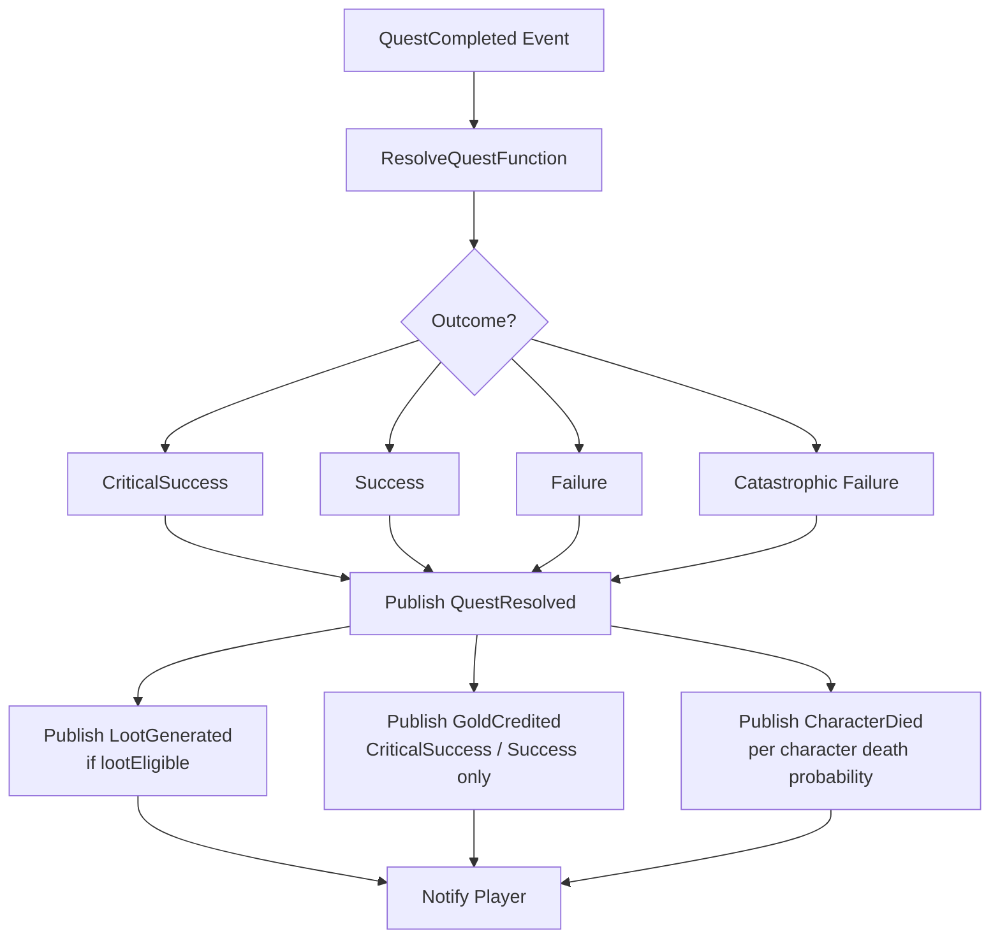

The quest resolution evaluates outcomes and publishes appropriate downstream events based on the result.

Character death is evaluated independently per character for every outcome type (CriticalSuccess 1%, Success 2%, Failure 20%, CatastrophicFailure 60% — see GDD §6). Loot is only generated when `lootEligible` is true. Gold is only awarded for CriticalSuccess and Success outcomes.

---

# 11. Recruitment Workflow

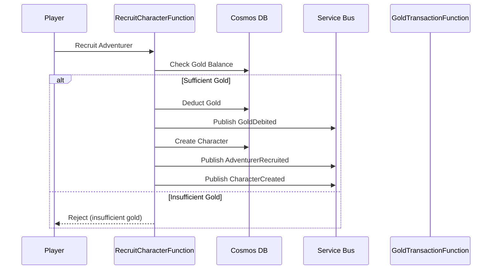

Recruitment validates the guild balance before creating the character.

---

# 12. Deployment Pipeline

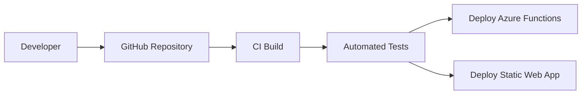

Continuous integration ensures reliable deployments.

---

# Suggested Repo Layout

You could store architecture docs like this:

```
/docs
    architecture.md
    system-diagrams.md
    event-model.md
```

Keeping these diagrams in the repository mimics **real enterprise documentation practices**.

---